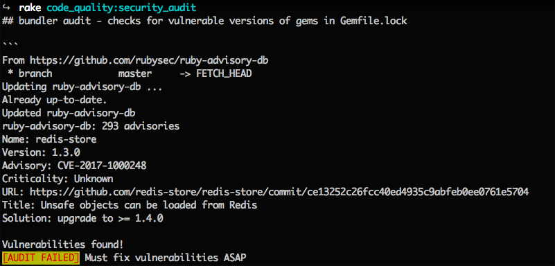
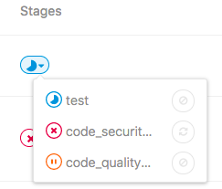
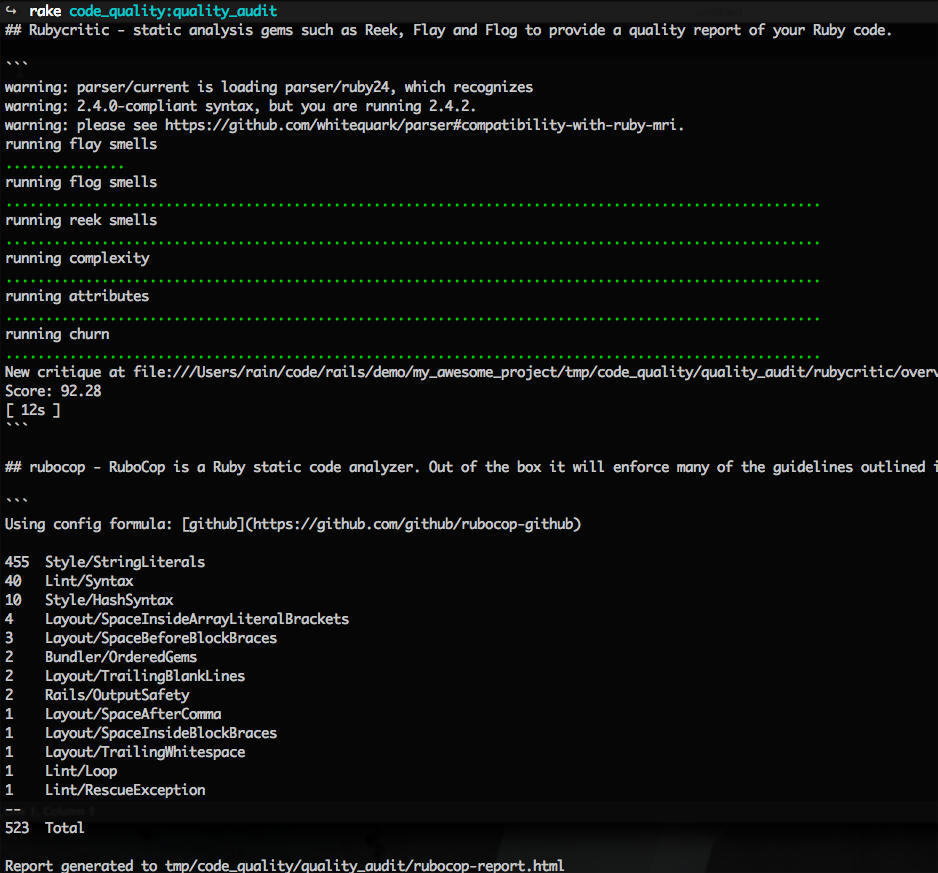
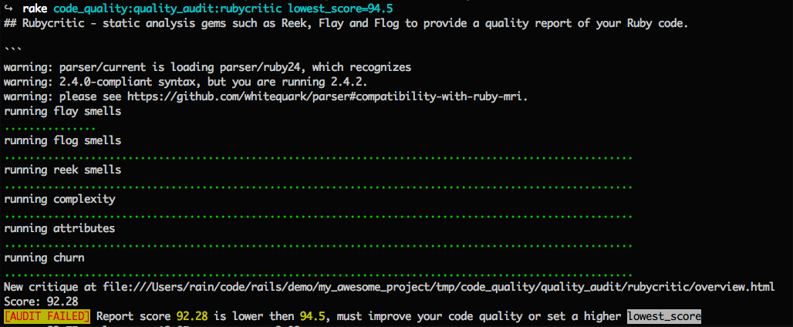
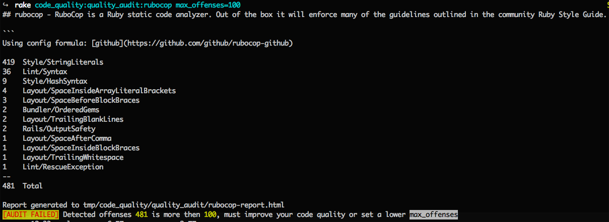
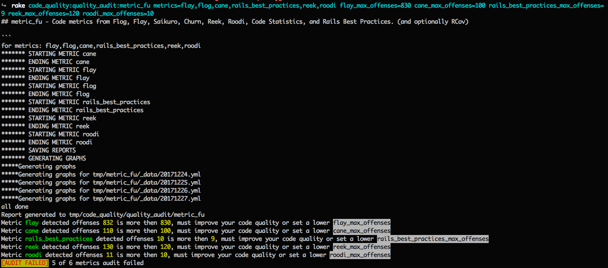
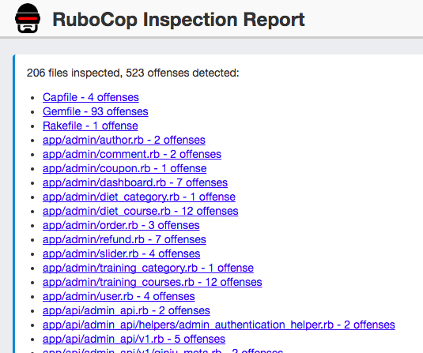

# CodeQuality

Run code quality and security audit report with one rake task as `rake code_quality`.

[](https://badge.fury.io/rb/code_quality)
[](https://travis-ci.org/rainchen/code_quality)
[](http://hits.dwyl.io/rainchen/code_quality)

## Principle

> If you can’t measure it, you can’t improve it.


## Installation

Add this line to your application's Gemfile:

```ruby
group :development do
  gem 'code_quality'
end
```

And then execute:

    $ bundle

## Usage

To generate security audit and code quality report:

```
rake code_quality
```

will output report like:

```
# Code Quality Report

Generated by code_quality (v0.1.3) @ 2018-01-12 16:32:20 +0800

## bundler audit - checks for vulnerable versions of gems in Gemfile.lock

......

```

[Code Quality Report Example](doc/code_quality_report_example.md)

[Code Quality Report Details Example](https://rainchen.github.io/code_quality/)

### Two major audit tasks

There are 2 types of audit tasks: `security_audit` and `quality_audit`, each sub task can be run separately.

In summary: 

- run `rake code_quality:security_audit` to get security audit report
- run `rake code_quality:quality_audit` to get code quality report

### Report result using Markdown format

You can output report using `rake code_quality > code_quality_report.md` then open it with a Markdown editor.


### Security Audit

Use [bundler-audit](https://rubygems.org/gems/bundler-audit) for patch-level verification for ruby projects which using `bundler`,
 use [brakeman](https://rubygems.org/gems/brakeman) to detect security vulnerabilities for Rails applications.

#### usage:

```
# run security audit tasks
rake code_quality:security_audit
```

output example:




#### work with CI

Recommend setting up this task as part of a CI pipeline. For example, adding a job to stage "test" for Gitlab-CI:

```
# .gitlab-ci.yml
code_security_audit:
  stage: test
  script:
    - bundle exec rake code_quality:security_audit
```
Gitlab-CI pipeline example:



Then Gitlab sends notification with the failure info, for example:


[Tips] Code analyzers are your friends for writing secure code, since they're diligent and they don't get tired, thirsty, hungry, or bored.


#### Each sub task can be run separately

```
# bundler audit - checks for vulnerable versions of gems in Gemfile.lock
rake code_quality:security_audit:bundler_audit
```

```
# brakeman audit - checks Ruby on Rails applications for security vulnerabilities
rake code_quality:security_audit:brakeman
```

```
# show helpful URLs
rake code_quality:security_audit:resources
```


### Code Quality Audit

Base on these ruby code analysis gems, you can choose suitable ones for your project:

- use [rubycritic](https://github.com/whitesmith/rubycritic) static analysis gems such as Reek, Flay and Flog to provide a quality report and get an evaluated score of your Ruby code.

- use [rubocop](https://github.com/bbatsov/rubocop/) to audit coding style and get refactor suggestion.

- use [metric_fu](https://github.com/metricfu/metric_fu) to get many kinds of code metrics from Flog, Flay, Saikuro, Churn, Reek, Roodi, Code Statistics, and Rails Best Practices. (and optionally RCov)


In summary: 

- run `rake code_quality:rubycritic` to get an evaluated score and code smells
- run `rake code_quality:rubocop` to audit coding style and get refactor suggestions
- run `rake code_quality:metric_fu` to get many kinds of code metrics, including rails best practice suggestions, recommend to use for rails project


#### usage:

```
# run all code quality audit tasks
rake code_quality:quality_audit
```

output example:



[Tips] You don't have to run all audit tasks, some code metrics are the same using by rubycritic and metric_fu. You can choose them based on your needs, the more tasks will take longer running time, unless you don't care about time-consuming problem.


#### Run audit task with audit value option

Audit task will return non-zero exit status and showing failure reason when passing an audit value option and the value is lower than the result in report, for example:

```
# audit with lowest_score option
rake code_quality:quality_audit:rubycritic lowest_score=94.5
```

output example:



#### Each audit task accepts different audit value options

##### options for rubocop

```
# e.g.: rake code_quality:quality_audit:rubocop rubocop_max_offenses=100
# options:
#   config_formula: use which formula for config, supports "github, "rails" or path_to_your_local_config.yml, default is "github"
#   cli_options: pass extract options, e.g.: cli_options="--show-cops"
#   rubocop_max_offenses: if config rubocop_max_offenses then audit it with detected offenses number in report, e.g.: rubocop_max_offenses=100
```

output example:



##### options for metric_fu

```
# e.g.: rake code_quality:quality_audit:metric_fu metrics=stats,rails_best_practices,roodi rails_best_practices_max_offenses=9 roodi_max_offenses=10
# options:
#   metrics: default to run all metrics, can be config as: cane,churn,flay,flog,hotspots,rails_best_practices,rcov,reek,roodi,saikuro,stats
#   flay_max_offenses: offenses number for audit
#   cane_max_offenses: offenses number for audit
#   rails_best_practices_max_offenses: offenses number for audit
#   reek_max_offenses: offenses number for audit
#   roodi_max_offenses: offenses number for audit
```

output example:




##### options can be joint together

```
# run all at once
rake code_quality:quality_audit lowest_score=90 rubocop_max_offenses=100 metrics=stats,rails_best_practices,roodi rails_best_practices_max_offenses=10 roodi_max_offenses=10
```

#### work with CI

Configure audit value options that matching to your own ruby/rails project, for example:

```
# .gitlab-ci.yml
code_quality_audit:
  stage: test
  script:
    - bundle exec rake code_quality:quality_audit lowest_score=93 rails_best_practices_max_offenses=10

```

[Tips] Don't rely on your diligence, just let CI doing the boring/repeating/time-consuming jobs can make you more enjoyable in programming.


#### code quality audit task report

Code quality audit task report will be saved to `tmp/code_quality/quality_audit/`, and will be auto open in web browser.

rubycritic report example:


rubocop report example:



metric_fu report example:


metric_fu analyzed file report example:


## Development

After checking out the repo, run `bin/setup` to install dependencies. Then, run `rake spec` to run the tests. You can also run `bin/console` for an interactive prompt that will allow you to experiment.

To install this gem onto your local machine, run `bundle exec rake install`. To release a new version, update the version number in `version.rb`, and then run `bundle exec rake release`, which will create a git tag for the version, push git commits and tags, and push the `.gem` file to [rubygems.org](https://rubygems.org).

## Contributing

Bug reports and pull requests are welcome on GitHub at https://github.com/rainchen/code_quality.

## License

The gem is available as open source under the terms of the [MIT License](https://opensource.org/licenses/MIT).
